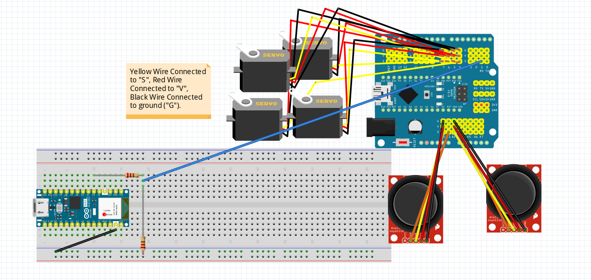

# 3 Joint Robotic Arm

For my project, I made a robotic arm that is controlled by 2 joysticks.   The arm can move up, down, spin by the base, and the claw can close and open.  Currently, my arm is connected to an ESP32 which receives the angles of the arm and displays it onto a website.  
<!---I made a robotic arm and claw that is controlled by joystick   (Not completed) -->

<!--You should comment out all portions of your portfolio that you have not completed yet, as well as any instructions:-->
<!--- This is an HTML comment in Markdown -->
<!--- Anything between these symbols will not render on the published site -->

| **Engineer** | **School** | **Area of Interest** | **Grade** |
|:--:|:--:|:--:|:--:|
| Benjamin O. | Northwood High | Mechanical Engineering | Incoming Sophomore |

  
# Final Milestone

<iframe width="560" height="315" src="https://www.youtube.com/embed/dapA_x_85sM?si=Iy0P-3X4tyCPVUxJ" title="YouTube video player" frameborder="0" allow="accelerometer; autoplay; clipboard-write; encrypted-media; gyroscope; picture-in-picture; web-share" referrerpolicy="strict-origin-when-cross-origin" allowfullscreen></iframe>

+ For my final milestone, I created a WebServer through the ESP32 that reads the anlges of the servo motors on the arm.  By connecting the arduino nano and the nano esp32, they could communicate through serial.  So, when my joysticks send an input through to the arduino that moves the servos, the arduino reads the angles of the servo and sends it to the esp32.  These values are then passed to the web server, which updates the displayed angles on the website each second by automatically reloading the page.

+ The biggest challenge I have faced during my time at BSE was trying to understand the code that came with my modification.  Even though there were many tutorials about my specific modification, there was still a lot to learn about it with the help of my instructor and I eventually gained a much better understanding about how it worked.

+ Throughout the program I learned more about Arduino, electronics, serial communication, and also improved my debugging skills through experimentation with the base arm code and researching.

+ In the future, I plan on implementing real time updates to my website and also having it control the servos directly, or implementing something related to math.
  
# Second Milestone

<iframe width="560" height="315" src="https://www.youtube.com/embed/QebH0tHOgoQ?si=9-RoM77yHwNBYQTp" title="YouTube video player" frameborder="0" allow="accelerometer; autoplay; clipboard-write; encrypted-media; gyroscope; picture-in-picture; web-share" referrerpolicy="strict-origin-when-cross-origin" allowfullscreen></iframe>

+ For my second milestone, I finished the code of the arm, which functions by constantly reading the inputs by the joystick, which gets interpreted by the arduino nano (the microcontroller) and tells the servos what to do.

+ One challenge I had faced while finishing the code was that once I had run it, the base servo was not moving properly, and was constantly getting stuck.  To fix this I loosened the screws on the base and also editing the delay to make it shorter and less jittery.

+ In my final milestone, I plan to have the arm read the angles through a web server, which will be coded in HTML.

# First Milestone

<iframe width="560" height="315" src="https://www.youtube.com/embed/WEVPtltrrHc?si=PYCW5egRnC96kiO_" title="YouTube video player" frameborder="0" allow="accelerometer; autoplay; clipboard-write; encrypted-media; gyroscope; picture-in-picture; web-share" referrerpolicy="strict-origin-when-cross-origin" allowfullscreen></iframe>

+ For my first milestone, I finished base of the arm, which is composed of 4 servo motors (motors that rotate) and is controlled by joysticks which send data to the Arduino Nano board. 

+ Some challenges I faced was a damaged screw on a servo attachment which caused the base of the arm to fail to move around.  Removing the screw with a screwdriver became impossible, so I ended up fixing this problem with the use of tweezers.

+ In my second milestone, I plan to finish the code for the robotic arm.

# Schematics 
Here is my schematic of my project.

# Bill of Materials

| **Part** | **Note** | **Price** | **Link** |
|:--:|:--:|:--:|:--:|
| Cokoino Robtoic Arm | Contains the acrilyc parts of the arm, servos, nano shield, the nano, joysticks, and a few jumper wires. | $50 | <a href="https://www.amazon.com/LK-COKOINO-Compliment-Engineering-Technology/dp/B081FG1JQ1?source=ps-sl-shoppingads-lpcontext&ref_=fplfs&psc=1&smid=A121QRXIPYS4LW&gQT=1"> Link </a> |
| Electronics Component Kit | Includes wires, resistor, breadboard, and a connector wire. | $13.49 | <a href="https://www.amazon.com/Smraza-Electronics-Potentiometer-tie-Points-Breadboard/dp/B0B62RL725?th=1"> Link </a> |
| Arduino Nano ESP32 | Used to create the webserver that reads the angles of the servo motors. | $21 | <a href="https://www.amazon.com/Arduino-ABX00083-Bluetooth-MicroPython-Compatible/dp/B0C947BHK5/ref=sr_1_1?crid=XXKMD4BI15SK&dib=eyJ2IjoiMSJ9.GzP-GvhsR81ftjmV7C-hRSw3xCE-vFb8iSaSjMM6uu1IR5yIXFH4oudArXIMCVePDrlDinwBUQ5g1iugiHRVYUq7Vp_5-uq1_glw3QsWS4lZ5bcL6o2jIrfNr4V8_kncHGT68Sd3Vtfjd_63kyCPDnx602Ui_th0mY-wC778PNWYI-8E25M64p0ln86pii-Ed7U3ggnWOnCD2M3WpCKIXhh-lD_8fNxAYdCXESwE_YYtBvpjDqSjg1cyLu3p29fIT8rUHC6wkgW4QiNNzHyTm8h7KUEoXQN-wXVeHlg4tlw.3kW9CJ8QykGxJDI0_uTNjReD-_ZaBIVBg6AIzu2gtpA&dib_tag=se&keywords=arduino+nano+esp32&qid=1751483218&s=electronics&sprefix=arduino+nano+esp3%2Celectronics%2C147&sr=1-1"> Link </a> |
| Braided Charging Cables | Used as a data transfer cable to connect the ESP32 to computer. | $10 | <a href="https://www.amazon.com/Anker-2-Pack-Premium-Samsung-Galaxy/dp/B07DD5YHMH/ref=sr_1_2?crid=YZWL0OE9WL00&dib=eyJ2IjoiMSJ9.try91HmNUm2N7eWLcSoZ2etuZGg-05a9clikk9FgGx6AEt0zfq16EopkOwXfETjsK73hZV_veCWX7upHVzaEBWZzfRbBkhqfcPuLkn4kqwzQqC3Lalb_wRP8eNvTZj4Rka3IbnecCWRhW-AJ2eoqcLqGlp51oSC3WEJf3tTDEY82WRXk7PS5YIH6PPntYLD7CYWDX660UgZYm7LsjsN2xbKcewCb29jWI4EDTcmwiws2FQpR120FWvGQPu7Dsqt6vsX0GC8VX7jTDhKKJLmK3nPkSIyNKSSKGkjzE9FeUO4.1ATWtydlTWhnwcKBTIJdm581qnmWmModIkEbn9SgJoM&dib_tag=se&keywords=insignia%2Bbraided%2Bcharging%2Bcables%2Busb%2Bto%2Busbc&qid=1751483361&s=electronics&sprefix=insignia%2Bbraided%2Bcharging%2Bcables%2Busb%2Bto%2Busbc%2Celectronics%2C137&sr=1-2&th=1"> Link </a> |

# Other Resources/Examples

- [Arduino Nano ESP32 Web Server](https://newbiely.com/tutorials/arduino-nano-esp32/arduino-nano-esp32-web-server/)
- [UART Two Arduino Communication](https://peppe8o.com/arduino-uart-communication/)

